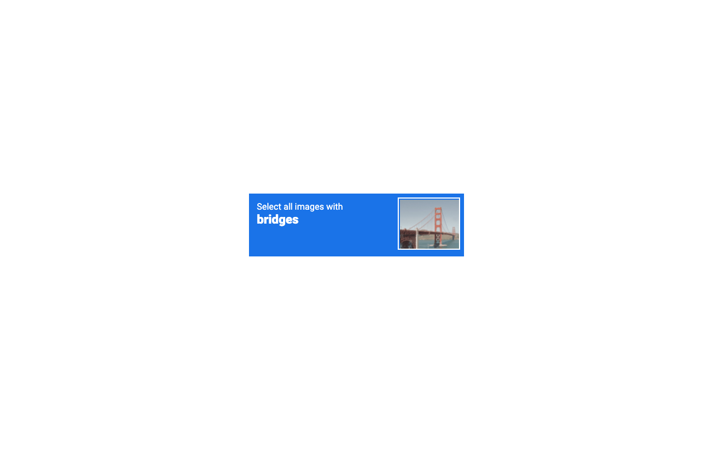
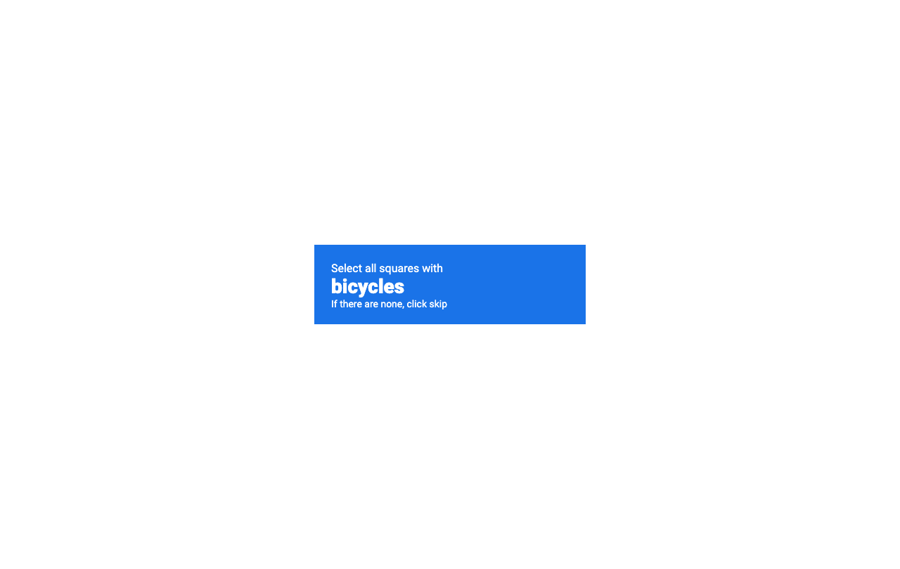
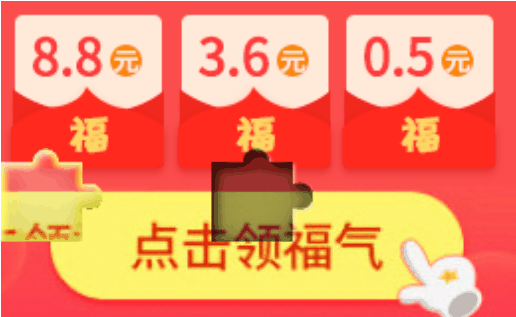
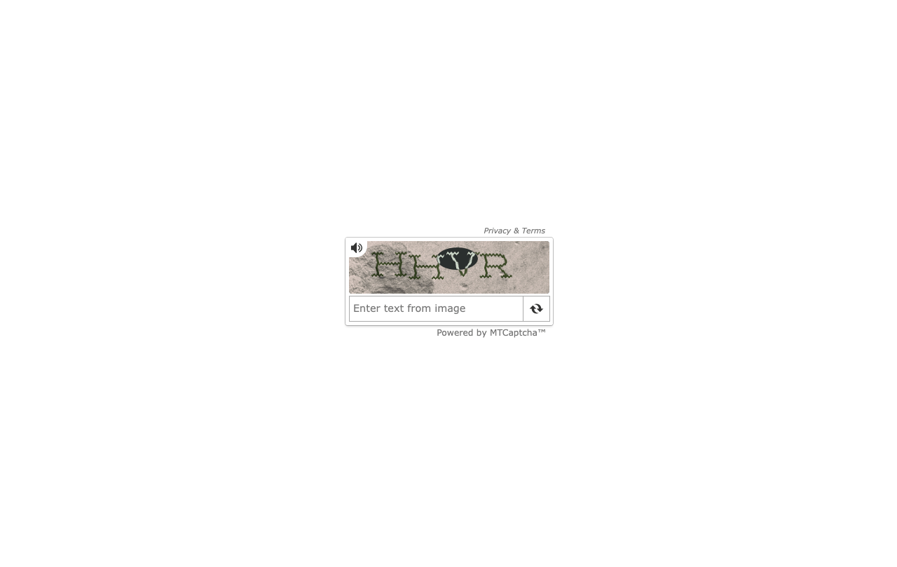

# AI-Powered CAPTCHA Solver

This project is a Python-based command-line tool that uses large multimodal models (LMMs) like OpenAI's GPT-4o and Google's Gemini to automatically solve various types of CAPTCHAs. It leverages Selenium for web browser automation to interact with web pages and solve CAPTCHAs in real-time.

A successful solve is recorded as a GIF in the `successful_solves` directory.

## Key Features

- **Multiple AI Providers**: Supports both OpenAI (e.g., GPT-4o) and Google Gemini (e.g., Gemini 2.5 Pro) models.
- **Multiple CAPTCHA Types**: Capable of solving a variety of CAPTCHA challenges.
- **Browser Automation**: Uses Selenium to simulate human interaction with web pages.
- **Extensible**: The modular design makes it easy to add support for new CAPTCHA types or AI models.
- **Benchmarking**: Includes a script to test the performance and success rate of the solvers.

## Supported CAPTCHA Types

The tool can solve the following CAPTCHA types found on the `2captcha.com/demo/` pages:

1.  **Text Captcha**: Simple text recognition.
2.  **Complicated Text Captcha**: Text with more distortion and noise.
3.  **reCAPTCHA v2**: Google's "I'm not a robot" checkbox with image selection challenges.
4.  **Puzzle Captcha**: Slider puzzles where a piece must be moved to the correct location.
5.  **Audio Captcha**: Transcribing spoken letters or numbers from an audio file.

## Prerequisites

- Python 3.7+
- Mozilla Firefox

## Installation & Configuration

1.  **Clone the repository:**
    ```bash
    git clone https://github.com/aydinnyunus/ai-captcha-bypass
    cd ai-captcha-bypass
    ```

2.  **Install dependencies:**
    ```bash
    pip install -r requirements.txt
    ```

3.  **Set up your API keys:**
    Create a `.env` file in the root directory by copying the example file:
    ```bash
    cp .env.example .env
    ```
    Open the `.env` file and add your API keys for OpenAI and/or Google Gemini:
    ```
    OPENAI_API_KEY="sk-..."
    GOOGLE_API_KEY="..."
    ```

## Usage

The primary script for running the solver is `main.py`. You need to specify the CAPTCHA type to test. You can also specify the AI provider and model.

### Command-Line Arguments

- `captcha_type`: (Required) The type of CAPTCHA to solve.
  - Choices: `puzzle`, `text`, `complicated_text`, `recaptcha_v2`, `audio`
- `--provider`: The AI provider to use.
  - Choices: `openai`, `gemini` (Default: `openai`)
- `--model`: The specific model to use (e.g., `gpt-4o`, `gemini-2.5-flash`).
- `--file`: Path to an audio file for the `audio` test. (Default: `files/audio.mp3`)

### Examples

**Solve a simple text CAPTCHA using OpenAI (default):**
```bash
python main.py text
```

**Solve a complicated text CAPTCHA using Gemini:**
```bash
python main.py complicated_text --provider gemini
```

**Solve a reCAPTCHA v2 challenge using Gemini:**
```bash
python main.py recaptcha_v2 --provider gemini
```

**Transcribe an audio CAPTCHA:**
```bash
python main.py audio --file files/radio.wav --provider openai
```

**Solve a puzzle CAPTCHA using a specific OpenAI model:**
```bash
python main.py puzzle --provider openai --model gpt-4o
```


## How It Works

1.  **Launch Browser**: The script starts a Firefox browser instance using Selenium.
2.  **Navigate**: It goes to the demo page for the specified CAPTCHA type.
3.  **Capture**: It takes screenshots of the CAPTCHA challenge (image, instructions, or puzzle).
4.  **AI Analysis**: The captured images or audio files are sent to the selected AI provider (OpenAI or Gemini) with a specific prompt tailored to the CAPTCHA type.
5.  **Get Action**: The AI returns the solution (text, coordinates, or image selections).
6.  **Perform Action**: The script uses Selenium to enter the text, move the slider, or click the correct images.
7.  **Verify**: The script checks for a success message to confirm the CAPTCHA was solved.

## Success Examples

Here are some examples of the solver successfully bypassing different CAPTCHA types.

| CAPTCHA Type         | OpenAI (GPT-4o)                                                                                  | Gemini (2.5 Pro)                                                                                 |
| -------------------- | ------------------------------------------------------------------------------------------------ | ------------------------------------------------------------------------------------------------ |
| **reCAPTCHA v2**     |           |           |
| **Puzzle**           |                 |                 |
| **Complicated Text** |       |       |

## Project Structure

- `main.py`: The main entry point to run the CAPTCHA solver tests. Handles command-line arguments and calls the appropriate test functions.
- `ai_utils.py`: Contains all the functions for interacting with the OpenAI and Gemini APIs. This is where prompts are defined and API calls are made.
- `puzzle_solver.py`: Implements the logic specifically for solving the multi-step slider puzzle CAPTCHA.
- `benchmark.py`: A script for running multiple tests to evaluate the performance and success rate of the different solvers.
- `requirements.txt`: A list of all the Python packages required for the project.
- `screenshots/`: Directory where screenshots of CAPTCHAs are temporarily saved.
- `successful_solves/`: Directory where GIFs of successful solutions are saved.

## Contact

[](https://linkedin.com/in/yunus-ayd%C4%B1n-b9b01a18a/) [](https://github.com/aydinnyunus/ai-captcha-bypass) [](https://instagram.com/aydinyunus_/) [](https://twitter.com/aydinnyunuss)
